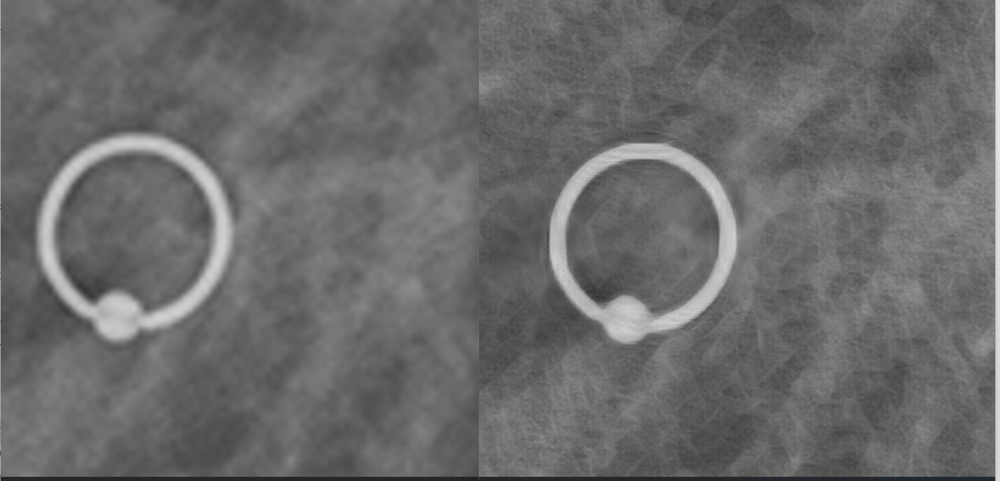

# IMPLEMENTATION OF SUPER-RESOLUTION GAN (SRGAN) FOR 
ENHANCING CHEST X-RAY IMAGE RESOLUTION IN PNEUMONIA 
PATIENTS



##  Overview

This project was developed to complete my undergraduate final thesis. It applies a **Super-Resolution Generative Adversarial Network (SRGAN)** to enhance chest X-ray images for pneumonia patients by reconstructing high-resolution images from low-resolution inputs.

The model uses a modified loss function tailored to X-ray characteristics (ChexNet Feature Extractor Layers)  to improve structural clarity and diagnostic quality.

Important Notes
This repository is dedicated to inference and model evaluation only.
The training process was conducted separately as part of the research and is not included in this repository due to scope and reproducibility considerations.

Model Information
model_generator_069.py contains the SRGAN generator architecture with pre-trained weights, developed and trained in the context of this study and prior experimental work by the author.

---

##  Dataset

* Labeled Optical Coherence Tomography (OCT) and Chest X-ray Dataset
* https://data.mendeley.com/datasets/rscbjbr9sj/2
* Total: **4,273 pneumonia chest X-ray images**

---

## 🧪 Results

| Metric | Value    |
| ------ | -------- |
| SSIM   | 0.8598   |
| PSNR   | 32.77 dB |
| MOS    | 4.0      |


---

##  Comparison

Compared with:

* SRResNet
* Pre-trained SRGAN (DIV2K)

The proposed model achieves the best performance in both **visual quality and quantitative metrics**.

---

## Project Structure

```
.
├── test.py
├── model/
|   ├── SRGAN_gene_069.pt
├── result
├── test_data
├── Test.py
├── dataset.py
├── ops.py
├── requirements.txt
├── srgan_model.py
├── assets

```

---

## Installation

### 1. Install dependencies

```bash
pip install -r requirements.txt
```

---

## How to Run (Testing Only)
first, imput your testing image in **test_data** folder , then 
```bash
python test.py
```
The output images are located in **result** folder
---

## Important Notes

* This repository is **ONLY for testing/inference**
* No training pipeline is included here

### Model Information

* `model/SRGAN_gene_069.pt`
  → This file contains the **pre-trained SRGAN generator model**, trained previously by the author (myself).

---

## Purpose

This repository focuses on:

* Image super-resolution inference
* Evaluation of trained SRGAN model
* Medical image enhancement for pneumonia diagnosis

---

## Sample Output

### Low Resolution → High Resolution


---

## Technologies Used

* Python
* TensorFlow / PyTorch (adjust sesuai kamu pakai)
* SRGAN architecture
* OpenCV
* NumPy

---

For academic and research purposes only.

